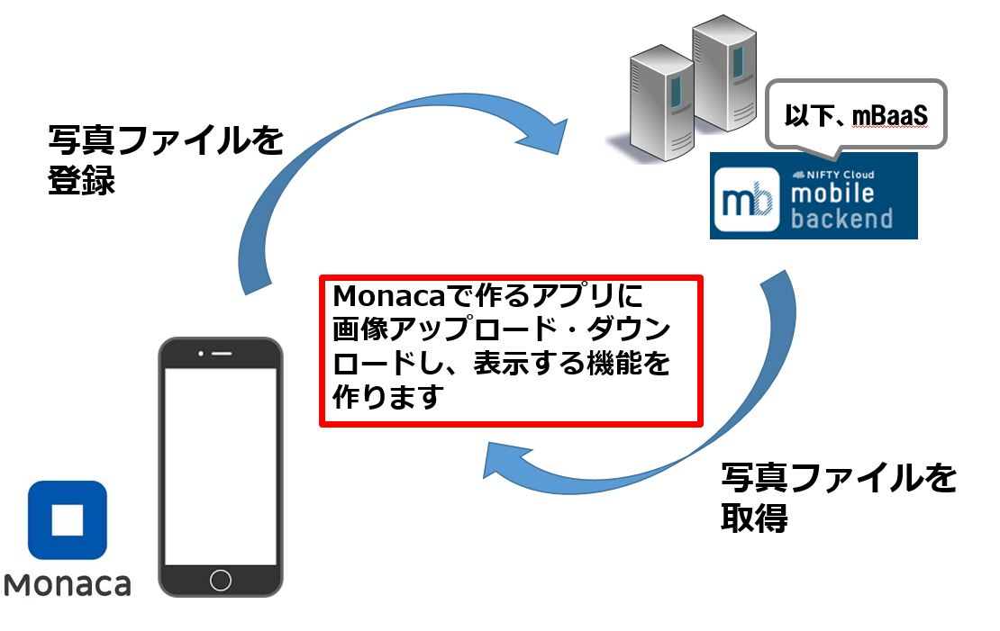
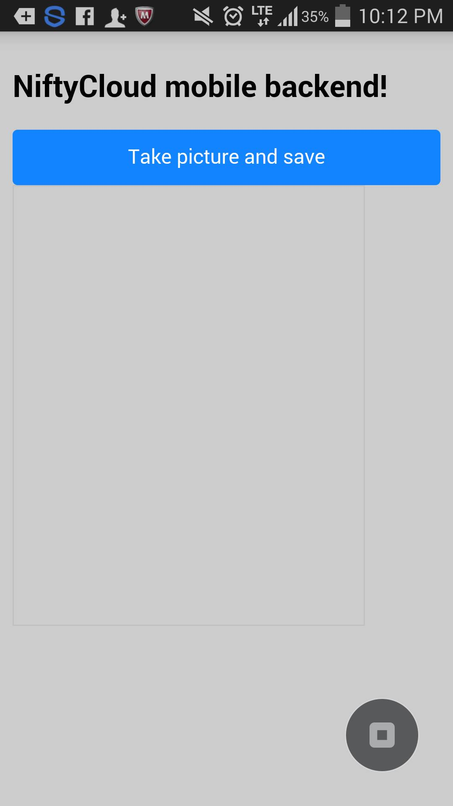
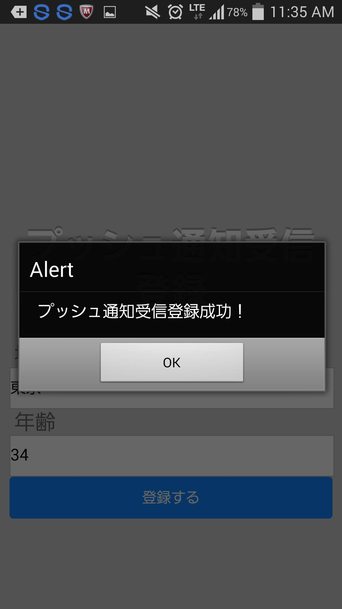
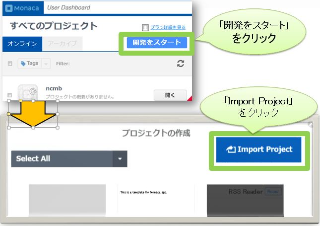
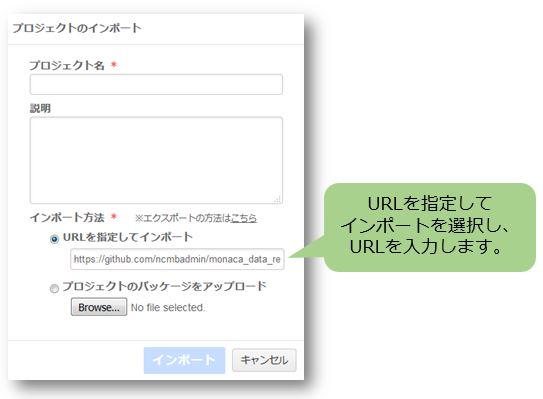
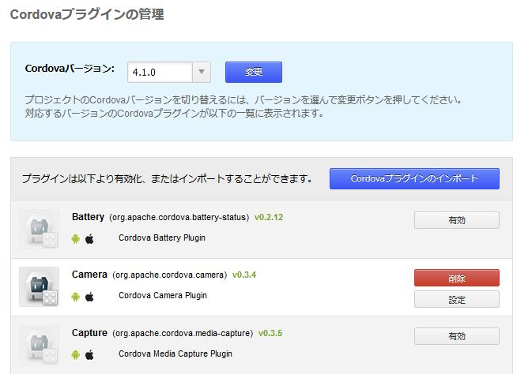
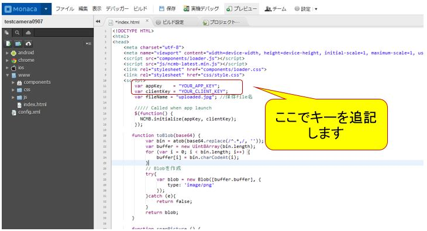

、# Monaca x NIFTYCLOUD mobile backend カメラ写真をアップ・ダウンロードするサンプル

===

# Overview

こちらはMonacaを利用して、カメラで写真を撮り、画像ファイルをmBaaSサーバーにアップし、ダウンロードするサンプルです。
* Android, iOSアプリをHTML, JavaScriptで簡単に作れるツール[Monaca](https://ja.monaca.io/)
* アプリのサーバー機能を簡単に作れるツール[Nifty cloud mobile backend](http://mb.cloud.nifty.com/) (以下からmBaaS)



## Demo

* MonacaでgithubのURL(Download zip file)をインポートし、
アプリキーとクライントキーを設定し、アプリを起動します。
「Take picture and save」ボタンを押し、カメラを起動し、
写真を撮り、自動的にファイル保存します。
保存したファイルをダウンロードし、画面に表示します

* トップ画面



* 取得完了画面




## Description

* コードの説明

File: www/index.html

 - 初期化設定

```JavaScript
var appKey    = "YOUR_APP_KEY";
var clientKey = "YOUR_CLIENT_KEY";
var fileName = "uploaded.jpg"; //保存File名

///// Called when app launch
$(function() {
  NCMB.initialize(appKey, clientKey);
});
```

上記のコードでキーを指定し、NCMB.initialize(appKey, clientKey), mBaaSサーバーと連携を行います。

* カメラ処理
```JavaScript
　　　function snapPicture () {
         navigator.camera.getPicture (onSuccess, onFail,
             { quality: 50, destinationType: Camera.DestinationType.DATA_URL});

         //成功した際に呼ばれるコールバック関数
         function onSuccess (imageData) {
             var byteCharacters = toBlob(imageData);
             var NCMBFile = new NCMB.File(fileName, byteCharacters, "image/png");
             NCMBFile.save().then(function() {
               //NCMBサーバーからファイルをダウンロード
               var getFile =  new NCMB.File(fileName);
               var image_canvas = document.getElementById("showImage");
               getFile.fetchImgSource(image_canvas);
             },
             function(error) {
             　// The file either could not be read, or could not be saved to NCMB.
               alert(JSON.stringify(error));
             });
         }

         //失敗した場合に呼ばれるコールバック関数
         function onFail (message) {
             alert ('エラーです: ' + message);
         }
　　 }
```

NCMBFileを利用し、save()メソッドを実装すると、ファイルを非同期的にアップロードします。
アップロードが成功したら、getFileを利用し、ファイルダウンロードを行い、
imgタグ"showImage"のドキュメントオブジェクトをfetchImgSource()に渡し、ダウンロードしたファイル中身を
表示することができます。

## Requirement

* Monaca環境：カメラプラグイン
* Nifty cloud mobile backend Javascript SDK version 1.2.6
ダウンロード：[Javascript SDK](http://mb.cloud.nifty.com/doc/current/introduction/sdkdownload_javascript.html)

## Installation

* Monacaで新規アプリ作成し、プロジェクトをインポートする。
  - monacaの利用登録する
    [Monaca](https://ja.monaca.io/)

  - monacaで新規プロジェクトを作成する



* Monacaでアプリ作成する: プロジェクトインポートを選択し、「URLを指定してインポートする」と選び、以下のURLからインポートする。
https://github.com/ncmbadmin/monaca_file_updownload/archive/master.zip


* MonacaでカメラPhonegapプラグインを有効にさせる



* mobile backendでアプリ作成する
  - mobile backendで利用登録する
    [Nifty cloud mobile backend](http://mb.cloud.nifty.com/)


* monacaで作成したアプリをmobile backendサーバーと連携させる
  - monacaでアプリキー、クライアントキーを設定し、初期化を行う: www/js/ncmb_push_start.js

キーをコピーし、追記します。


* 動作確認
  - monacaでビルドし、動作確認する

  - ダウンロードしたファイルを表示する


## Usage

サンプルコードをカスタマイズする、key, value変数を変更していただきます。
以下のドキュメントを参照し、データ保存・検索・プッシュ通知を入れることができる。
* [ドキュメント](http://mb.cloud.nifty.com/doc/current/)
* [ドキュメント・データストア](http://mb.cloud.nifty.com/doc/current/sdkguide/javascript/datastore.html)
* [ドキュメント・会員管理](http://mb.cloud.nifty.com/doc/current/sdkguide/javascript/user.html)
* [ドキュメント・プッシュ通知](http://mb.cloud.nifty.com/doc/current/sdkguide/javascript/push.html)


## Contributing

1. Fork it!
2. Create your feature branch: `git checkout -b my-new-feature`
3. Commit your changes: `git commit -am 'Add some feature'`
4. Push to the branch: `git push origin my-new-feature`
5. Submit a pull request :D

## License

* MITライセンス
* Nifty cloud mobile backendのJavascript SDKのライセンス
