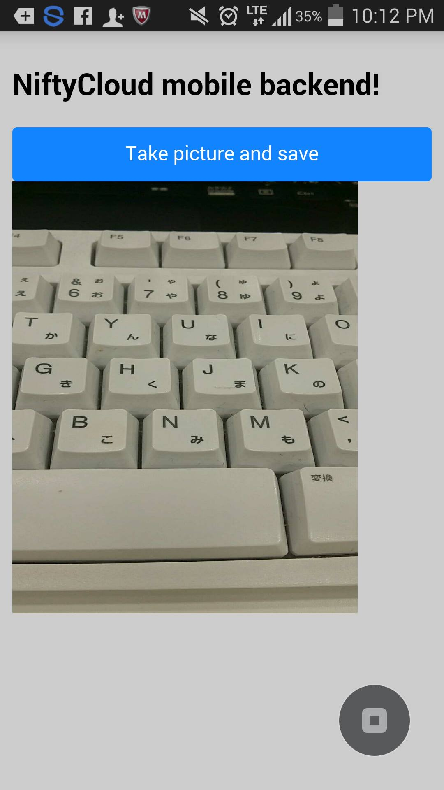

# Monaca x NIFTY Cloud mobile backend カメラ写真をアップ・ダウンロードするサンプル

===

# Overview

Monacaを用いて作ったアプリとmobile backendを連携して、スマホカメラで撮った写真をmBaaSサーバにアップロードする機能を実装するサンプルコードとなります。
* HTML/CSS/JavaScriptでマルチプラットフォーム（iOS/Android/Windowsなど）にアプリを開発できる統合開発環境[Monaca](https://ja.monaca.io/)
* スマホアプリのサーバ側機能（プッシュ通知、会員管理、DBなど）をサーバ開発不要で実装できる[NIFTY Cloud mobile backend](http://mb.cloud.nifty.com/?utm_source=community&utm_medium=referral&utm_campaign=sample_monaca_file_updownload)


## Demo

* MonacaでgithubのURL（https://github.com/ncmbadmin/monaca_file_updownload/archive/master.zip）をインポートし、アプリケーションキーとクライントキーを設定してください。

* 「Take picture and save」ボタンを押すと、カメラが起動します。写真を撮ると、自動的にmBaaS上へファイルを保存します。
* 保存したファイルをダウンロードし、画面に表示します

* 起動画面


* 取得完了画面




## Description

* コードの説明

File: www/index.html

 - 初期化設定

```JavaScript
var appKey    = "YOUR_APP_KEY";
var clientKey = "YOUR_CLIENT_KEY";
var fileName = "uploaded.jpg"; //保存File名

///// Called when app launch
$(function() {
  NCMB.initialize(appKey, clientKey);
});
```

上記のコードでアプリケーションキーとクライアントキーを指定し、
NCMB.initialize(appKey, clientKey)　でmBaaSサーバと連携を行います。

* カメラ処理
```JavaScript
　　　function snapPicture () {
         navigator.camera.getPicture (onSuccess, onFail,
             { quality: 50, destinationType: Camera.DestinationType.DATA_URL});

         //成功した際に呼ばれるコールバック関数
         function onSuccess (imageData) {
             var byteCharacters = toBlob(imageData);
             var NCMBFile = new NCMB.File(fileName, byteCharacters, "image/png");
             NCMBFile.save().then(function() {
               //NCMBサーバーからファイルをダウンロード
               var getFile =  new NCMB.File(fileName);
               var image_canvas = document.getElementById("showImage");
               getFile.fetchImgSource(image_canvas);
             },
             function(error) {
             　// The file either could not be read, or could not be saved to NCMB.
               alert(JSON.stringify(error));
             });
         }

         //失敗した場合に呼ばれるコールバック関数
         function onFail (message) {
             alert ('エラーです: ' + message);
         }
　　 }
```

NCMBFileを利用してsave()メソッドを実行すると、ファイルを非同期にてアップロードします。
アップロードが成功したら、getFileを利用してファイルのダウンロードを行います。
imgタグ"showImage"のドキュメントオブジェクトをfetchImgSource()に渡し、ダウンロードしたファイルの中身を表示させます。

## Requirement

* Monaca環境：カメラプラグイン
* NIFTY Cloud mobile backend Javascript SDK version 1.2.6
ダウンロード：[Javascript SDK](http://mb.cloud.nifty.com/doc/current/introduction/sdkdownload_javascript.html?utm_source=community&utm_medium=referral&utm_campaign=sample_monaca_file_updownload)

## Installation

* Monacaで新規アプリ作成し、プロジェクトをインポートする。
  - Monacaの利用登録する
    [Monaca](https://ja.monaca.io/)

  - Monacaで新規プロジェクトを作成する


* Monacaでアプリ作成する: プロジェクトインポートを選択し、「URLを指定してインポートする」と選び、以下のURLからインポートする。
https://github.com/ncmbadmin/monaca_file_updownload/archive/master.zip

* MonacaでカメラPhonegapプラグインを有効にさせる


* mobile backendでアプリ作成する
  - mobile backend 利用登録
    [NIFTY Cloud mobile backend](http://mb.cloud.nifty.com/?utm_source=community&utm_medium=referral&utm_campaign=sample_monaca_file_updownload)


* Monacaで作成したアプリをmobile backendサーバーと連携させる
  - Monacaでアプリケーションキー、クライアントキーを設定し、初期化を行う: www/js/ncmb_push_start.js


キーをコピーし、追記します。


* 動作確認
  - Monacaでビルドし、動作確認します

  - ダウンロードしたファイルを表示する


## Usage

サンプルコードをカスタマイズすることで、様々な機能を実装できます！
データ保存・データ検索・会員管理・プッシュ通知などの機能を実装したい場合には、
以下のドキュメントもご参考ください。

* [ドキュメント](http://mb.cloud.nifty.com/doc/current/?utm_source=community&utm_medium=referral&utm_campaign=sample_monaca_file_updownload)
* [ドキュメント・データストア](http://mb.cloud.nifty.com/doc/current/sdkguide/javascript/datastore.html?utm_source=community&utm_medium=referral&utm_campaign=sample_monaca_file_updownload)
* [ドキュメント・会員管理](http://mb.cloud.nifty.com/doc/current/sdkguide/javascript/user.html?utm_source=community&utm_medium=referral&utm_campaign=sample_monaca_file_updownload)
* [ドキュメント・プッシュ通知](http://mb.cloud.nifty.com/doc/current/sdkguide/javascript/push.html?utm_source=community&utm_medium=referral&utm_campaign=sample_monaca_file_updownload)


## Contributing

1. Fork it!
2. Create your feature branch: `git checkout -b my-new-feature`
3. Commit your changes: `git commit -am 'Add some feature'`
4. Push to the branch: `git push origin my-new-feature`
5. Submit a pull request :D

## License

* MITライセンス
* NIFTY Cloud mobile backendのJavascript SDKのライセンス
